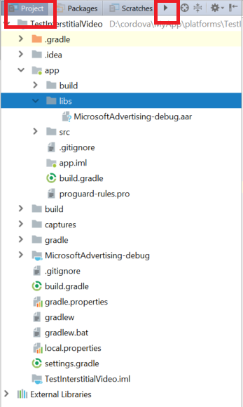
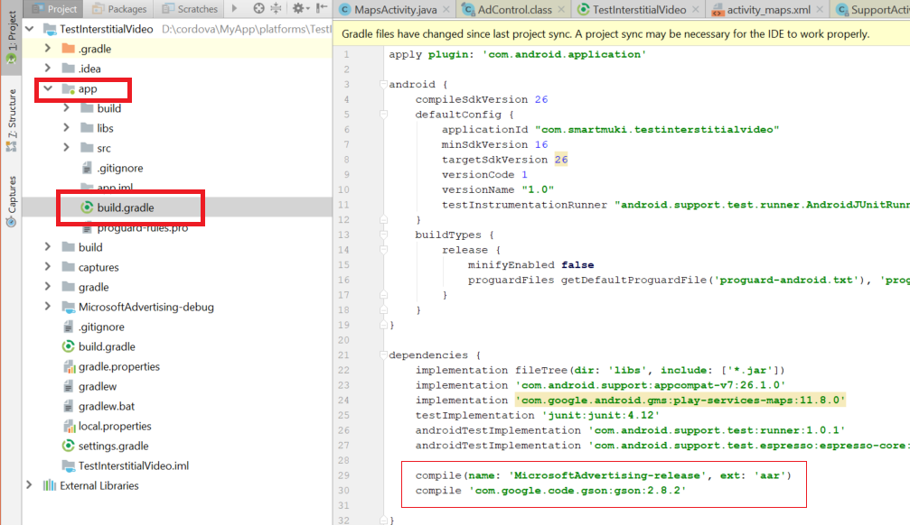
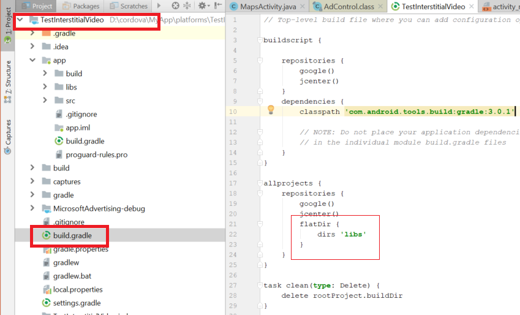

# Get started with the Microsoft Advertising SDK for Android (beta)

Increase your revenue opportunities by showing ads in your Android apps by using the Microsoft Advertising SDK for Android (beta). Our SDK offers a variety of ad types and supports mediation with many popular ad networks.

This guide describes how to import the Microsoft Advertising SDK for Android into your project and provides step-by-step instructions for displaying the following types of ads:

* [Interstitial video](#add-an-interstitial-video-ad)
* [Native](#add-a-native-ad)

## Prerequisites

* The Microsoft Advertising SDK for Android. Currently, this SDK is currently only available as a private beta. To request access, send us an email at aiacare@microsoft.com.
* [Android Studio](https://developer.android.com/studio/) version 1.0 or a later version.
* The [minSdkVersion](https://developer.android.com/guide/topics/manifest/uses-sdk-element) attribute in your project targets [API Level](https://developer.android.com/guide/topics/manifest/uses-sdk-element#ApiLevels) 16 or higher.
* To show live ads in the public version of your app, you must get a live [ad unit](#ad-units) ID to use in your code. To get a live ad unit ID, send us an email at aiacare@microsoft.com.

## Import the Microsoft Advertising SDK into your app

Currently, the Microsoft Advertising SDK for Android is not available via the Maven repository. You must include the AAR file for the SDK directly into your project.

> **Note**&nbsp;&nbsp;The following instructions assume that you have already downloaded the AAR file for the Microsoft Advertising SDK for Android. The SDK is currently available as a private beta. To request access to the SDK, please reach out to us at aiacare@microsoft.com.

  1. Create a **libs** folder under the app folder of your project if it doesn’t already exist, and copy the AAR file for the SDK to this folder. Make sure the  **Project** tab is selected. If **Android** or any other tab is selected, use the triangle button to switch to **Project**.

      

  4. Reference the AAR file in your project-level build.gradle file. Add the compilation target as demonstrated in the following example.
      ```
      dependencies {
          implementation fileTree(dir: 'libs', include: ['*.jar'])

          compile(name: 'MicrosoftAdvertising-release', ext: 'aar')

          // Add the below if you don't have any version of gson already added.
          compile 'com.google.code.gson:gson:2.8.2'
      }
      ```

      The following screenshot demonstrates this option.

      

      As an alternative, you can include *.aar* in your *fileTree* declaration.

      ```
      dependencies {
          implementation fileTree(dir: 'libs', include: ['*.jar', '*.aar'])

          // Add the below if you don't have any version of gson already added.
          compile 'com.google.code.gson:gson:2.8.2'
      }
      ```

  5. In your module’s build.gradle file, add the below statement to allow Gradle to compile your libs folder.
      ```
      allprojects {
          repositories {
              google()
              jcenter()

              flatDir {
                  dirs 'libs'
              }
         }
      }
      ```

      The following screenshot demonstrates this.

      

  6. Save the buld.gradle file and perform a Gradle sync.

## Add an interstitial video ad

Interstitial video ads are ads that occur full screen at a specific moment in your app. Because these ads are interstitial ads, they block the user flow on your app, and therefore you should strategically choose when to show these ads.

### Add a view to your layout

Add a view to your **Activity** or **Fragment** layout where you want the interstitial ad to play. Below is an example in which a **RelativeLayout** element is added in your main_activity.xml file to host an interstitial video ad.

```xml
<RelativeLayout xmlns:android="http://schemas.android.com/apk/res/android"
    xmlns:tools="http://schemas.android.com/tools"
    android:layout_width="match_parent"
    android:layout_height="match_parent"
    tools:context=".MapsActivity">

    <fragment xmlns:android="http://schemas.android.com/apk/res/android"
        xmlns:map="http://schemas.android.com/apk/res-auto"
        xmlns:tools="http://schemas.android.com/tools"
        android:id="@+id/map"
        android:name="com.google.android.gms.maps.SupportMapFragment"
        android:layout_width="match_parent"
        android:layout_height="match_parent"
        tools:context="com.test.testinterstitialvideo.MapsActivity" />

    <RelativeLayout
        android:id="@+id/adsContainer"
        android:layout_width="wrap_content"
        android:layout_height="match_parent"
        android:layout_gravity="center">
    </RelativeLayout>

</RelativeLayout>
```

> **Important**&nbsp;&nbsp;Because interstitial ads occupy the full screen, the dimensions of the view which you pass to the **AdControl** constructor is altered by the **AdControl**. Therefore, the **AdControl** should have a **RelativeLayout** as its parent in order for it to be full screen.

### Display the ad

After adding the view to the layout, the next step is to create an **AdControl** object within the view where you want the interstitial video ad to appear. Additionally, you may want to handle the activity’s lifecycle events and call the respective methods on **AdControl**. The same guidance applies if you are using a **Fragment** instead of an **Activity**.

```java
package com.test.testinterstitialvideo;

import android.os.Bundle;
import android.support.v4.app.FragmentActivity;
import android.widget.RelativeLayout;
import android.widget.TextView;

import com.microsoft.advertising.AdControl;

public class MapsActivity extends FragmentActivity {

    private AdControl control;

    @Override
    protected void onCreate(Bundle savedInstanceState) {
        super.onCreate(savedInstanceState);
        setContentView(R.layout.activity_maps);

        RelativeLayout adContainer =     (RelativeLayout)this.findViewById(R.id.adsContainer);
        control = new AdControl(this, "applicationId", "adunitId", "videoInterstitial", adContainer);

        SupportMapFragment mapFragment = (SupportMapFragment) getSupportFragmentManager()
                .findFragmentById(R.id.map);
        mapFragment.getMapAsync(this);
    }

    @Override
    protected void onPause() {
        super.onPause();

        if (this.adObject != null) {
            control.pauseAd(this.adObject);
        }
    }

    @Override
    protected void onResume() {
        super.onResume();

        if (this.adObject != null) {
            control.resumeAd(this.adObject);
        }
    }

    @Override
    protected void onDestroy() {
        super.onDestroy();
        control.destroy();
       control = null;
    }
}
```

Pass the following parameters to the **AdControl** constructor:

* **this**: The activity which shows the ad.
* **applicationId**: Replace this string from the code example with the bundle ID of your Android app.
* **adunitId**: Replace this string from the code example with the ID for the [ad unit](#ad-units). To display a test ad, pass the value *test*.
* **videoInterstitial**: Pass this string to display an interstitial video ad.
* **adContainer**: The view where you want the ad to be displayed.

The previous code example creates the **AdControl** object needed to display the ad. The final step towards showing your ad is to register for the ad events. This is done by passing by invoking the **registerListener** method of the **AdControl** and passing to it an implementation of the **com.microsoft.advertising.AdControlListener** class.

```java
package com.test.testinterstitialvideo;

import android.os.Bundle;
import android.support.v4.app.FragmentActivity;
import android.widget.RelativeLayout;
import android.widget.TextView;

import com.microsoft.advertising.AdControl;

public class MapsActivity extends FragmentActivity {

    private AdControl control;

    @Override
    protected void onCreate(Bundle savedInstanceState) {
        super.onCreate(savedInstanceState);
        setContentView(R.layout.activity_maps);

        RelativeLayout adContainer = (RelativeLayout)this.findViewById(R.id.adsContainer);
        control = new AdControl(this, "applicationId", "adunitId", "videoInterstitial", adContainer);

     control.registerListener(new com.microsoft.advertising.AdControlListener() {
      @Override
      public void onAdReady(String adObject) {
        // The ad is ready. Play it whenever you want.
        control.showAd(adObject);
      }

      @Override
      public void onAdError(String errorObject) {
          // There was an error fetching/rendering the ad.
          control.destroy();
          control = null;
      }

      @Override
      public void onAdEnd(String adObject) {
          // The video has ended.
          control.destroy();
          control = null;
      }
    });
  }
}
```

> **Note**&nbsp;&nbsp;For interstitial video ads, users have an option to skip the ad after 5 seconds.

## Add a native ad

Native ads are ads where you have some control over the look and feel of the ad. Our service returns all the assets of the ad individually, including the ad title, and you can decide how to place them inside your app. You can blend these assets with your other app components and provide a consistent user experience.

### Add a view to your layout

Add a view to your **Activity** or **Fragment** layout where you want the native ad to appear. Below is an example in which a **RelativeLayout** element is added in your main_activity.xml file to host a native ad. We have added a **TextView** and an **ImageView** to show the **AdTitle** and one of the **AdImage** objects. You could update your view as you wish along with the appropriate styling.

```xml
<RelativeLayout xmlns:android="http://schemas.android.com/apk/res/android"
    xmlns:tools="http://schemas.android.com/tools"
    android:layout_width="match_parent"
    android:layout_height="match_parent"
    tools:context=".MapsActivity">

    <fragment xmlns:android="http://schemas.android.com/apk/res/android"
        xmlns:map="http://schemas.android.com/apk/res-auto"
        xmlns:tools="http://schemas.android.com/tools"
        android:id="@+id/map"
        android:name="com.google.android.gms.maps.SupportMapFragment"
        android:layout_width="match_parent"
        android:layout_height="match_parent"
        tools:context="com.test.testnative.MapsActivity" />

    <RelativeLayout
        android:id="@+id/adsContainer"
        android:layout_width="wrap_content"
        android:layout_height="match_parent"
        android:layout_gravity="center">
        <TextView
            android:id="@+id/adTitle"
            android:layout_width="match_parent"
            android:layout_height="wrap_content" />
         <ImageView
            android:id="@+id/adImage"
            android:layout_width="wrap_content"
            android:layout_height="wrap_content" />
    </RelativeLayout>

</RelativeLayout>
```

### Display the ad

After adding the view to the layout, the next step is to create an **AdControl** object within the view where you want the native ad to appear.

```java
package com.test.testnative;

import android.os.Bundle;
import android.support.v4.app.FragmentActivity;
import android.widget.RelativeLayout;
import android.widget.TextView;

import com.microsoft.advertising.AdControl;
import com.microsoft.advertising.nativeAd.NativeAd;

public class MapsActivity extends FragmentActivity {

    private AdControl control;

    @Override
    protected void onCreate(Bundle savedInstanceState) {
        super.onCreate(savedInstanceState);
        setContentView(R.layout.activity_maps);

        RelativeLayout adContainer = (RelativeLayout)this.findViewById(R.id.adsContainer);
        control = new AdControl(this, "applicationId", "adunitId", "native", adContainer);

        SupportMapFragment mapFragment = (SupportMapFragment) getSupportFragmentManager()
                .findFragmentById(R.id.map);
        mapFragment.getMapAsync(this);
    }

    @Override
    protected void onDestroy() {
        super.onDestroy();
        control.destroy();
       control = null;
    }
}
```

Pass the following parameters to the **AdControl** constructor:

* **this**: The activity which shows the ad.
* **applicationId**: Replace this string from the code example with the bundle ID of your Android app.
* **adunitId**: Replace this string from the code example with the ID for the [ad unit](#ad-units). To display a test ad, pass the value *test*.
* **native**: Pass this string to display a native ad.
* **adContainer**: The view where you want the ad to be displayed.

The previous code example creates the **AdControl** object needed to display the ad. The final step towards showing your ad is to register for the ad events and request the native ad assets. This is done by passing by invoking the **registerListener** method of the **AdControl** and passing to it an implementation of the **com.microsoft.advertising.AdControlListener** class.

```java
package com.test.testnative;

import android.os.Bundle;
import android.support.v4.app.FragmentActivity;
import android.widget.RelativeLayout;
import android.widget.TextView;

import com.microsoft.advertising.AdControl;
import com.microsoft.advertising.nativeAd.NativeAd;

public class MapsActivity extends FragmentActivity {

    private AdControl control;

    @Override
    protected void onCreate(Bundle savedInstanceState) {
        super.onCreate(savedInstanceState);
        setContentView(R.layout.activity_maps);

        RelativeLayout adContainer = (RelativeLayout)this.findViewById(R.id.adsContainer);
        control = new AdControl(this, "applicationId", "adunitId", "native", adContainer);

     control.registerListener(new com.microsoft.advertising.NativeAdControlListener() {
      @Override
      public void onAdReady(String adObject, NativeAd nativeAd) {
        // The ad is ready. The nativeAd object
        // contains all the assets.
         ((TextView)findViewById(R.id.adTitle)).setText(nativeAd.title);

         if (nativeAd.mainImages != null && nativeAd.mainImages.length > 0) {
             ((ImageView)findViewById(R.id.adImage))
                 .setImageURI(nativeAd.mainImages[0].source);
        }

        control.showAd(adObject);
      }

      @Override
      public void onAdError(String errorObject) {
          // There was an error fetching the ad.
          control.destroy();
          control = null;
      }

      @Override
      public void onAdEnd(String adObject) {
          // Don’t do anything.
      }
    });
  }
}
```

### NativeAd and NativeAdImage objects

The **NativeAd** object contains various assets that you can integrate into your app using your own choice of fonts, colors and animations.  

> **Note**&nbsp;&nbsp;At a minimum, you must show the description and title in your native creative.

|  Property  |  Description  |
|------------|---------------|
| **callToAction** | Gets the call to action text for the native ad. |
| **description** | Gets the description for the native ad. You must display the description in your native creative.  |
| **iconImage** | Gets the icon image for the native ad, as supplied by the ad sponsor. Usually these are small images to be used in the ad to indicate the ad source. |
| **mainImages** | Gets the main images for the native ad, as supplied by the ad sponsor. Use the width and height to maintain the aspect ratio. |
| **sponsoredBy** | Gets the brand name of the sponsor for the product that is being advertised in the native ad.  |
| **title** | Gets the title for the native ad. You must display the title in your native creative. |

The **iconImage** and **mainImages** properties contain **NativeAdImage** objects that have the following properties.

|  Property  |  Description  |
|------------|---------------|
| **height** | Gets the height of the icon or main image for the native ad.  |
| **source** | Gets the source URI of the icon or main image file for the native ad.   |
| **width** | Gets the width of the icon or main image for the native ad.   |

## Ad units

When you add code to display ads in your app, you must pass an ad unit ID to the *adUnitId* parameter of the **AdControl** constructor. To test your code, pass the string **test** to the *adUnitId* parameter. This retrieves a test ad from our service. Test ads can only be used in a test version of your app.

For the public version of your app that is available to customers, you must update your code to pass a live ad unit ID to the *adUnitId* parameter. To get a live ad unit ID that you can use with the beta release of the Microsoft Advertising SDK for Android, send us an email at aiacare@microsoft.com.
